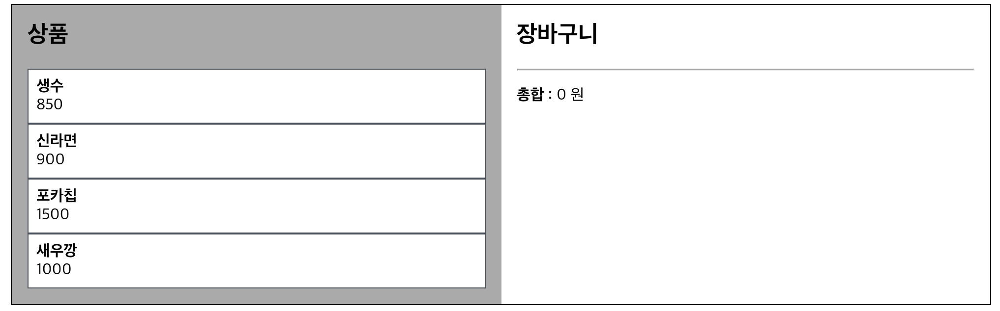
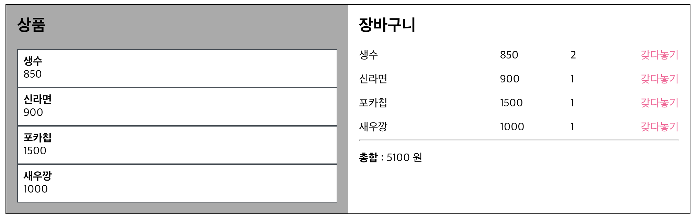

# study-mobx

## 설치

create-react-app로 React 프로젝트 생성.
추가적으로 설치한 라이브러리

```json
"mobx": "^6.0.4",
"mobx-react": "^7.0.5",
```

```shell
yarn
or
npm i
```

## 실행

```
yarn start
or
npm start
```

## 소개

MobX를 공부하면서 찾은
[벨로퍼트님 게시글](https://velog.io/@velopert/MobX-3-심화적인-사용-및-최적화-방법-tnjltay61n) 에 해당하는 내용을 따라서 작성한 코드입니다.

`decorator`에 bable, eslint 에러가 발생하여 추가적인 조취를 할 수 있었지만, `makeAutoObservable`로 자동으로 할당되게 처리하였습니다.

---

프로젝트는 간단한 상품 목록이 있고 그것들을 클릭하였을 때, 장바구니에 넣으며, 총 합까지 계산 결과를 보여주는 프로젝트 입니다.

## UI



초기화면



상품을 담은 화면
